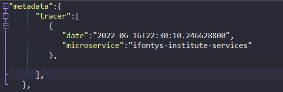
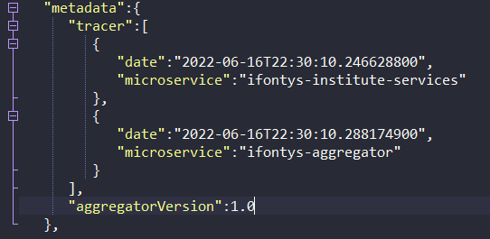
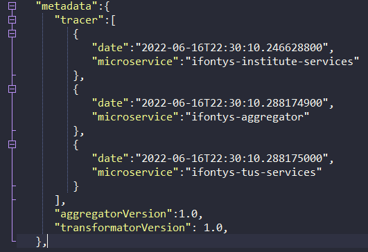

# Distributed Data POC ( Event logging)

## 1. Inhoud
- [1. Inhoud](#1-inhoud)
- [2. Document Historie](#2-document-historie)
- [3. Document Doel](#3-document-doel)
- [4. Introductie](#4-introductie)
- [5. Uitwerking](#5-uitwerking)
- [6. Resultaat](#6-resultaat)

## 2. Document Historie
| Version | Changes       | Author                         | Date       |
|---------|---------------|--------------------------------|------------|
| 0.1     | Initial Setup | Ruben Leerentveld & Rick Meels | 20-06-2022 | 

## 3. Document Doel
Samen hebben we gewerkt aan het leerdoel "distributed data". 
Om dit leerdoel aan te tonen en tevens te gebruiken als POC voor ons onderzoek hebben we event logging geïmplementeerd in ons project.
In dit document kun je ons implementatie proces terugvinden.

## 4. Introductie
Een van de 4 modellen die beschreven staan in canvas omschrijft "event logging". Simpelweg het bijhouden van dingen die gebeuren in het systeem.
Ons leek het een goed idee om bij te houden waar een message is van voor tot achter in het systeem en wat er precies mee gedaan is.
We hebben het volgende idee aan Merel gepitcht:
We houden per message die door het systeem gaat metadata bij. Hierin zal terug te vinden zijn door welke microservice het bericht is geweest, waar de data vandaan komt en de versie van de aggregator die gebruikt is voor het aggregeren van data.

## 5. Uitwerking
Ons systeem bestaat uit enkele microservices:
- User Endpoint
  - Bevat de aanroepbare functies voor het ophalen van docenten en matches
  - Bevat de aggregator
- Institute service
- Tus Endpoint

De metadata zal in de institute endpoint geïnitialiseerd worden en aangevuld worden in de overige microservices

## 5.1 Institute service
In de institute service komt het eerste bericht tot leven, daar initialiseren we de metadata.
We maken een class Logger.java

Deze class bezit een functie genaamd "AddLog".
Addlog maakt een JSONObject aan genaamd "metadata". In dat object zit een JSONArray waar elke microservice logging aan toe zal voegen ("Tracer")

Als we dan een request doen krijgen we bovenaan de docenten data en stuk metadata dat er als volgt uit ziet:

Op deze manier kunnen we nu dus terug zien op welke data de message bij welke microservice is geweest

## 5.2 User Endpoint
Nu krijgt de user endpoint de docenten data terug met de metadata.
Wat we nu moeten doen is de message aggregeren en logging toevoegen aan de metadata (servicenaam, tijd en versie van de aggregator)
Het toevoegen doen we op de zelfde manier, we deserializen eerst de metadata, voegen data toe en serializen daarna weer.
Dit resulteerd in de volgende data:

## 5.3 Tus service

Nadat de message geaggregeerd is krijgt de TUS service de message binnen met metadata.
Ook hier doen we hetzelfde: deserializen, log toevoegen en weer serializen.
Nadat de message bij de 3 microservices is geweest is de volgende metadata het resultaat:

## 6 Resultaat
Door metadata toe te voegen krijgen we inzicht in waar de message is geweest in het systeem.
Met dit inzicht krijgen we grip op de data, vele vlakken zal dit helpen.
- Developers weten waar het bericht is geweest en kunnen debuggen waar nodig
- Non functional requirements kunnen bewaakt worden (Execution time)
- Auditing (An auditor can get insight in where data has been)
- GDPR (Partners can see where the personal data has been)