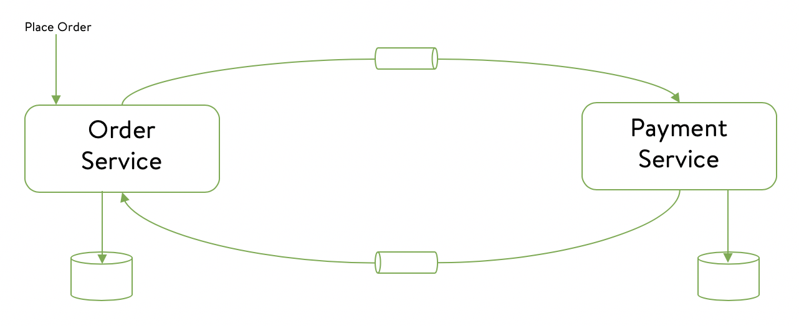

# 1. Inhoud
- [1. Inhoud](#1-inhoud)
- [2. Document historie](#2-document-historie)
- [3. Inleiding](#3-inleiding)
  - [3.1. Overzicht](#31-overzicht)
  - [3.2. Doel van het onderzoek](#32-doel-van-het-onderzoek)
  - [3.3. Onderzoeksvragen](#33-onderzoeksvragen)
- [4. Scope](#4-scope)
- [5. Onderzoeksstrategiën](#5-onderzoeksstrategiën)
- [6. Onderzoek](#6-onderzoek)
  - [6.1 Hoe verschilt distributed data tussen een microservice architectuur en een standaard MVC architectuur?](#61-hoe-verschilt-distributed-data-tussen-een-microservice-architectuur-en-een-standaard-mvc-architectuur)
  - [6.2 Wat is de 3 V's van data?](#62-wat-is-de-3-vs-van-data)
  - [6.3 Distributed Data specifieke garanties?](#63-distributed-data-specifieke-garanties)
  - [6.4 Welke modellen zijn toepasbaar op distributed data?](#64-welke-modellen-zijn-toepasbaar-op-distributed-data)
- [7. Referenties](#7-referenties)
    - [3 V's](#3-vs)
    - [ACID Principe](#acid-principe)
    - [CAP Theorem](#cap-theorem)
    - [Base Principe](#base-principe)
    - [Data-centric architecture development](#data-centric-architecture-development)

# 2. Document historie

| Versie | Veranderingen                                                                                                                                  | Datum      |
|-------:|------------------------------------------------------------------------------------------------------------------------------------------------|------------|
|    0.1 | Eerste opzet document                                                                                                                          | 30-05-2022 |
|    0.2 | Uitwerking deelvragen: - ACID principe - BASE principe Strategieen toegevoegd Gestart met sub-vraag 4 Lay-out aanpassingen | 16-6-2022  |

# 3. Inleiding

## 3.1. Overzicht

Om het leerdoel distributed data aan te tonen en bij te dragen aan het leerdoel context based research zullen wij (Rick & Ruben) samen een context based research doen over het onderwerp distributed data.

## 3.2. Doel van het onderzoek

Het doel van het onderzoek is om te kijken hoe distributed data werkt, maar uiteraard ook hoe distributed in de praktijk gebruikt en geimplementeerd kan worden. Als het onderwerp distributed data duidelijk is en we weten hoe dit geimplementeerd moet worden. Dan wordt het in de toekomst makkelijker om voor distributed data te gaan.

## 3.3. Onderzoeksvragen

**Hoofdvraag:**

Hoe kan data gedistribueerd worden op basis van een microservice architectuur?

**Onderzoeksvragen:**
1. Hoe verschilt distributed data tussen een microservice architectuur en een standaard MVC architectuur?
2. Wat is de 3 V's van data?
3. Distributed Data specifieke garanties?
4. Welke modellen zijn toepassbaar op distributed data?

# 4. Scope

De scope van het onderzoek is om te onderzoeken wat Distributed Data exact is en wat het kan bieden in de praktijk. Wat zijn de toepassingen van distributed data? Wat is de toegevoegde waarde van Distributed Data? en hoe zijn deze praktijken toe te passen? In dit onderzoek zal dan ook alleen Distributed Data aanbod komen.

# 5. Onderzoeksstrategiën

Hoe verschilt distributed data tussen een microservice architectuur en een standaard MVC architectuur?
- IT architecture sketching

Wat is de 3 V's van data?
- Literature

Distributed Data specifieke garanties?
- Literature

- Expert interview

Welke modellen zijn toepassbaar op distributed data?

- Prototyping
- Pitch
- Brainstorm
- Available product analysis

# 6. Onderzoek

## 6.1 Hoe verschilt distributed data tussen een microservice architectuur en een standaard MVC architectuur?

## 6.2 Wat is de 3 V's van data?

***Cloud***

Vandaag de dag groeit de "cloud" enorm. Maar wat is cloud?
Cloud is de naam die engineers gegeven hebben aan de leegte tussen LAN's in netwerktekeningen, ook wel "The undefined stuff in between".
Het internet is ondertussen het grootste "The undefined stuff in between" ooit geworden, de cloud dus.

Big Data is ook een vaag woord dat veel gebruikt wordt maar wat is dat?
Net zoals bijna alles in de tech sector hangt dat af van hoe je het bekijkt. 
Je kan Big Data kan gezien worden als data dat te groot is voor traditioneel data management om mee om te gaan.

Big Data wordt beschreven volgens de 3 V's
1. Volume
2. Velocity
3. Variety

***Volume***
Volume is de v die het meest verwant is met big data. Bij volume praten we over de kwantiteit van data dat kan oplopen tot onhandelbare getallen.
Data komt vanuit allerlij kanten en de hoeveelheid data op de wereld groeit meer en meer.
Denk bijvoorbeeld aan de hoeveelheid IoT (Internet of things) devices die aangesloten zijn en elk moment van de dag data produceren

***Velocity***
Velocity is de 2e 'V' die big data beschrijft.
Als voorbeeld: Facebook gebruikers uploaden cummulatief 900 miljoen fotos per dag!

Velocity beschrijft de snelheid waarmee data geproduceerd wordt.

***Variety***
De 3e V staat voor variety. De data die voorkomt in de wereld is of zijn niet alleen maar rows en columns zoals dat jaren geleden was. Dat betekend dat niet alle data goed past in een spreadsheet of database applicatie. 

***De 3 V's managen***
Er zijn ontelbare manieren om de 3 V's te managen, maar de grootste vuistregel waar je aan vast kan houden is: Wanneer je praat over data en termen die verder gaan dan buckets, wanneer je begint te praten over epic kwantiteiten, grote flow en een wijd assortiment, dan heb je het over big data.

Een laatste gedachtegang: er zijn mannieren om big data uit te pluizen en inzicht te geven dat toegepast kan worden op het oplossen van problemen en herkennen van kansen. Dat process wordt analytics genoemd. Daarom hoor je vaak als er gepraat wordt over big data, ook de term analytics in dezelfde zin.

De 3 V's beschrijven data die geanalyzeerd kan worden (het process waar je waarde uit data haalt). Alles bij elkaar genomen is er het potentieel voor erbazingwekkend inzicht of zorgwekkend overzicht. Net als bij elke grote kracht komt er ook bij big data een grote belofte en verantwoordelijkheid kijken.

***Conclusie***
Big data wordt uitgedrukt in 3 V's. Volume (hoeveeheid data), velocity(snelheid waarmee data komt) en varierty(de verschillende soorten data.
Als je twijfelt over of je met big data bezig bent kun je je houden aan de volgende vuistregel: Wanneer je praat over data en termen die verder gaan dan buckets, wanneer je begint te praten over epic kwantiteiten, grote flow en een wijd assortiment, dan heb je het over big data. 
Analytics is het proces waar je data uitpluist om inzicht te geven wat toegepast kan worden op het oplossen van problemen en herkennen van kansen
## 6.3 Distributed Data specifieke garanties?

Op het gebied van databases zijn relational databases al bekend, waarin transacties worden gebruikt om updates van informatie te verwerken. Als er in grote hoeveelheden data/gegevens worden bijgewerkt kan dit een uitdaging zijn om de inhoud van de database(s) in een geldige staat te houden. Om te voorkomen dat data wordt verloren kan er een mechanisme worden gebruikt om de transacties te valideren. Het mechanisme wat dan toegepast kan worden, wordt ook wel het ACID-principe genoemd. Het ACID-principe is een principe dat gebruikt wordt om de transacties van een database te valideren.

***ACID principe***

Als er een bank account is waarvan $100 van account A naar account B wordt overgemaakt moeten er twee transacties worden gedaan.

1. Haal $100 van account A
2. Geef $100 aan account B

Tijdens het uitvoeren van deze stappen kan er echter een aantal dingen misgaan. Bijvoorbeeld:

- De applicatie op de server kan crashen na stap 1
- De database kan crashen tijdens stap 2
- Twéé personen kunnen dezelfde transactie doen

Het ACID principe is een principe dat gebruikt wordt om de transacties van een database te valideren en staat voor:

- **Atomicity:** Als een reeks bewerkingen wordt gestart als een transactie, slaagt alles of niets. Als het bijvoorbeeld wordt geactiveerd als onderdeel van een transactie, worden zowel stap 1 als stap 2 bij het overboeken van die $100 van rekening A naar B van kracht, indien succesvol, of beide falen. Er zal geen gedeeltelijke transactie worden gemaakt.
- **Consistency:** Een ID van een medewerker binnen een organisatie moet voor iedereen uniek zijn. Elke medewerker moet een afdeling hebben waar de medewerker bij hoort. De eigenschap Consistency zorgt ervoor dat deze feiten altijd behouden blijven. Relational databases zorgen ervoor dat het gebruik maakt van unieke sleutels.
- **Isolation:** Het betekent dat een lopende transactie niet mag worden gezien of gezien door andere gelijktijdig lopende transacties. Het zou anders nooit in staat zijn om de staat terug te zetten naar het begin.
- **Durability:** Eeenmaal committed, mogen de updates van een transactie niet verloren gaan. Databasesystemen maken hiervoor gebruik van write-ahead logs, harde schijven, back-ups, enz.

Nu is dit heel goed voor een enkel data systeem, echter zodra er meerdere systemen geintroduceerd worden, die voornamelijk het ACID principe volgen, kan dit voor problemen zorgen. Daarvoor zijn er andere rule-sets die toegepast kunnen worden om dit af te vangen.

***CAP theorem***

Het CAP theorem bestaat uit drie componenten omdat ze betrekking hebben op distributed data opslag:

- **Consistency:** betekend dat alle clients dezelfde versie van de data hebben.
- **Availability:** betekend dat alle clients bij het maken van een verzoek, altijd een antwoord krijgen.
- **Partition tolerence:** betekend dat het cluster moet blijven werken ondanks communicatiestoringen tussen knooppunten.

NoSQL (non-relational) databases zijn ideaal voor distributed netwerk applicaties. In tegenstelling tot hun verticaal schaalbare SQL (relational) tegenhanger, zijn NoSQL-databases horizontaal schaalbaar en worden ze door ontwerp gedistribueerd.

NoSQL-databases worden geclassificeerd op basis van de twéé CAP-kenmerken die ze ondersteunen:

- **CP Databases:** Een CP database levert consistentie en partition-tolerence ten koste van beschikbaarheid. Wanneer een partitie optreed tussen twee willekeurige knooppunten, moet het systeem het niet-consistente knooppunt afsluiten.
- **AP Databases:** Een AP database levert beschikbaarheid en partition-tolerence ten koste van consistentie. Wanneer een partitie optreedt, blijven alle knooppunten beschikbaar, maar die aan het verkeerde uiteinde van een partitie kunnen een oudere versie van gegevens ontvangen.
- **CA Databases:** Een CA database zorgt voor consistentie en beschikbaarheid op alle knooppunten. Het kan dit echter niet doen als er een partitie is tussen twee willekeurige knooppunten in het systeem.

***BASE principe***

BASE staat voor **B**asically-**A**vailable **S**oft-state **E**ventually-consistent. Wat de onderdelen betekenen staat hieronder uitgelegd:

- **B**asically-**A**vailable: Een gedistribueerd systeem zou beschikbaar moeten zijn om met enige bevestiging te reageren (zelfs als het een foutbericht is) op elk binnenkomend verzoek.
- **S**oft-state: Het systeem kan van status blijven veranderen wanneer het nieuwe informatie ontvangt.
- **E**ventually-consistent: De componenten in het systeem weerspiegelen mogelijk niet dezelfde waarde/status van een record op een bepaald tijdstip. Ze zullen het uiteindelijk met de tijd regelen.

>**Voorbeeld:** Als er gekeken wordt naar de volgende twee onderling verbonden, maar onafhankelijke services, kunnen de volgende verwerkingsstappen op hoog niveau zijn

1. Klant plaats order
2. De `Order Service` werkt de details bij in de lokale database. Het markeert de betalingsstatus als `payment_initiated`
3. De `Order Service` stuurt een bericht naar de wachtrij, om door de `Payment Service` opgepakt te worden
4. De `Payment Service` ontvangt het bericht, maar om de een of andere reden mislukt de betalingsverwerking. Het werkt de details bij in een lokale database en stuurt ook een bericht naar de `Order Service` met de details
5. De `Order Service` werkt zijn payment record als `payment_failed` en stuurt de alternatieve betalingslinks naar de gebruiker
6. Stap **3** en **4** worden opnieuw uitgevoerd wanneer de gebruiker de betaling opnieuw probeert. Na een succesvolle afronding van de betaling, werkt de `Payment Service` zijn gegevens bij als `payment_complete` en stuurt nog een bericht met de updates naar de `Order Service`
7. De `Order Service` werkt zijn record bij met `payment_complete`

In dit voorbeeld kon de `Payment Service` reageren op de `Order Service`, hoewel de verwerking zelfs de eerste keer mislukte. De `Order Service` had de lokale betalingsstatus gewijzigd op basis van de updates die van de `Payment Service` waren ontvangen en de `Order` en `Payment Service` hadden verschillende betalingsstatussen, terwijl de definitieve status pas ne een tijdje werd bijgewerkt.

***Conclusie***

Nu duidelijk wat de principes inhouden en kunnen bieden is er niet een specifieke principe die gebruikt wordt voor het maken van een gedistribueerde applicatie. Onderdelen van het ene principe zijn te vinden in de andere principe, ze kunnen dus niet echt gezien worden als een afzonderlijke regel/stelling/principe, maar meer een leidraad die ons op het goede pad brengt. Uiteraard komen bepaalde kenmerken meer naar boven dan andere bij verschillende principes.

## 6.4 Welke modellen zijn toepasbaar op distributed data?

Omdat data aan het veranderen is en het gebruik van data nog sneller verandert, is er een enorme groei in het aantal datatools en ontwerpstrategieen die dit ondersteunen. Hieronder staan 5 verschillende modellen uitgelicht voor het opnemen van data in voor het ontwikkelproces waar grotendeels niet aan gedacht wordt.

**_Data-centric architecture development_**

Organisaties beginnen meer te kijken naar data-centric modellen, want er zijn veel limitaties met betrekking tot application-centric toepassingen. Het voornamelijkste is dat met een data-centric architecture de data aan de frontline staat.

Veel online bedrijven hebben sinds hun oprichting een data-centrische benadering gevolgd. Ze organiseren hun infrastructuur en services op een manier die de gegevensstructuur handhaaft, ongeacht hoe individuele applicaties worden geimplementeerd, bijgewerkt, vervangen of buiten gebruik worden gesteld. Wat er ook gebeurd, de data zal blijven voortbestaan.

Met de data-centrische benadering ontwerpen IT-teams infrastructuur rond gegevensvereisten in plaats van gegevens pasbaar te maken in de infrastructuur. Hoewel kosten en operationeel gemak nog steeds belangrijk zijn, worden de gegevens centraal gezet voor de manier van deployen in de infrastructuur.

**_Data stream processing_**

Op de markt van vandaag zijn er veel oplossingen voor dynamic data stream processing oplossingen te vinden, wat niet alleen een mooie oplossing is, maar wat ook absoluut meer complexiteit in de architectuur brengt. De reden hiervan is dat data niet alleen opgeslagen wordt, maar het analyseren en beschikbaar stellen van data aan de desbetreffende applicaties (op een snelle manier) komt er ook bij kijken. Een bijkomend probleem is dat met Data streaming data altijd in beweging is en (bijna) nooit stil staat.

De data die in beweging is wordt doormiddel van event streaming platforms geleverd zoals Confluent. Met deze vraag is het dan ook de bedoeling om een antwoord te kunnen geven op de vraag hoe data streaming werkt en hoe dit eventueel toegepast kan worden in de praktijk.

<!-- veel verschillende dynamische data sources, omdat er zoveel keuze is, heeft het de enterprise omgeving in de data architectuur een stuk complexer gemaakt met de reden dat het niet alleen opslaan van data is, maar ook het analyseren en beschikbaar stellen aan applicaties op een snelle manier

Met het probleem van data, komt ook het probleem dat data altijd in beweging is.

De data die in beweging is wordt geleverd door event streaming platforms zoals Confluent, met deze vraag is het de bedoeling om hier een antwoord op te geven hoe data streaming werkt en hoe dit eventueel toegepast kan worden.

**Event streaming**

event streaming is een manier van ontwerpen en ontwikkelen van applicaties, de applicaties reageren op dingen die om zich heen gebeuren, in andere woorden, de applicaties reageren op events. Deze events worden aangemaakt door applicaties die een event streaming mechanisme gebruiken om informatie te distribueren.

Wat is een event

Een event is een feit - iets dat gebeurd is in het verleden:

- een gebruiker heeft een actie uitgevoerd
- een item is verwijderd uit een winkelwagen

Als een applicatie zo een event binnenkrijgt, kan de betreffende applicatie hierop handelen.

Deze applicaties worden ook wel stream processing applicaties genoemd.

Organizaties implementeren event streaming om real-time processing uit te kunnen voeren en er zijn hier verschillende redenen voor:

- Het verbeteren van customer experience
- Nieuwe functionaliteit wat eerst niet geimplementeerd kon worden
- Uiteraard de competitie op de markt

https://assets.confluent.io/m/26933af228cc1d15/original/20211129-Guide-Adopting_Confluent.pdf -->

**_Data event sourcing_**

**_Distributed Data Structures (DDS)_**

**Prototyping**

Uit de voorbeeldmodellen in canvas die gaan over distributed data passen we er een toe. We zullen eventlogging implementeren in onze microservices.
Er zal vanaf het eerste bericht metadata meegegeven worden die bijhouden bij welke microservice en op welk moment de message daar is geweest en belangrijke data zoals de versie van de aggregator en transformator die het bericht behandeld hebben.

**Available Product analysis**
Voor we begonnen aan onze eigen implementatie van eventlogging zijn we op het internet gaan zoeken naar oplossingen die al aangeboden voor event logging. 

# 7. Referenties

### 3 V's
- [https://bigdataldn.com/news/big-data-the-3-vs-explained/](https://bigdataldn.com/news/big-data-the-3-vs-explained/)
- [Reserach universiteit Bruhl](https://link.springer.com/article/10.1007/s12599-013-0249-5)
- 

### ACID Principe
1. [https://medium.com/@pranabj.aec/acid-cap-and-base-cc73dee43f8c](https://medium.com/@pranabj.aec/acid-cap-and-base-cc73dee43f8c)

### CAP Theorem

1. [https://www.bmc.com/blogs/cap-theorem/](https://www.bmc.com/blogs/cap-theorem/)
1. [https://www.ibm.com/cloud/learn/cap-theorem](https://www.ibm.com/cloud/learn/cap-theorem)
1. [https://en.wikipedia.org/wiki/CAP_theorem](https://en.wikipedia.org/wiki/CAP_theorem)
1. [https://fhict.instructure.com/courses/12090/pages/gdpr-and-data-complexities-theoretical-background?module_item_id=751978](https://fhict.instructure.com/courses/12090/pages/gdpr-and-data-complexities-theoretical-background?module_item_id=751978)
1. [https://www.youtube.com/watch?v=k-Yaq8AHlFA](https://www.youtube.com/watch?v=k-Yaq8AHlFA)

### Base Principe

1. [https://medium.com/@pranabj.aec/acid-cap-and-base-cc73dee43f8c](https://medium.com/@pranabj.aec/acid-cap-and-base-cc73dee43f8c)

### Data-centric architecture development

1. [https://dzone.com/articles/from-lambda-to-kappa-a-guide-on-real-time-big-data](https://dzone.com/articles/from-lambda-to-kappa-a-guide-on-real-time-big-data)
2. [https://www.vistaprojects.com/blog/data-centric-architecture/#:~:text=Within%20data%2Dcentric%20architecture%2C%20the,%2C%20business%20decisions%2C%20and%20culture.](https://www.vistaprojects.com/blog/data-centric-architecture/#:~:text=Within%20data%2Dcentric%20architecture%2C%20the,%2C%20business%20decisions%2C%20and%20culture.)
3. [https://tdan.com/the-data-centric-revolution-data-centric-vs-data-driven/20288](https://tdan.com/the-data-centric-revolution-data-centric-vs-data-driven/20288)
4. [https://www.techtarget.com/searchdatacenter/tip/Why-and-how-to-adopt-a-data-centric-architecture](https://www.techtarget.com/searchdatacenter/tip/Why-and-how-to-adopt-a-data-centric-architecture)
